# 按钮

按钮由文字或者图案组成，文字或者图案必须能让人轻易地和点击后展示的内容联系起来.
主要的按钮有三种:

* 悬浮响应按钮, 点击后会产生墨水扩散效果的圆形按钮。
* 浮动按钮, 常见的方形纸片按钮，点击后会产生墨水扩散效果.
* 扁平按钮, 点击后产生墨水扩散效果，和浮动按钮的区别是没有浮起的效果.

颜色饱满的图标应当是功能性的-尽量避免把他们作为纯粹装饰用的物体。

按钮的设计应当和应用的颜色主题保持一致.   

## 用法

   
悬浮响应按钮  

   
浮动按钮  

    
扁平按钮      

### 主按钮

按钮类型应该基于主按钮, 屏幕上容器的数量, 以及整体布局来选择.

首先，审视一遍你的按钮功能: 按钮功能是不是非常重要而且应用广泛到需要用上悬浮响应按钮?

然后，选择使用浮动按钮或者扁平按钮基于放置按钮的容器以及屏幕上层的数量。应该避免过多的层叠。

最后，检查你的布局. 一个容器应该只使用一种类型的按钮. 只在比较特殊的情况下（比如需要强调一个浮起的效果）才应该混合使用多种类型按钮.

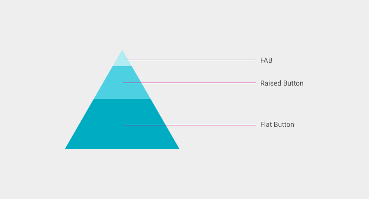        
   
### 对话框中的按钮

对话框中使用扁平按钮作为主要按钮类型以避免过多的层次叠加。

   

   
 
### 按钮内部

根据特定的布局来选择使用扁平按钮或者浮动按钮. 对于扁平按钮，应该在内部四周留出足够的空间以使按钮清晰可见。   

    

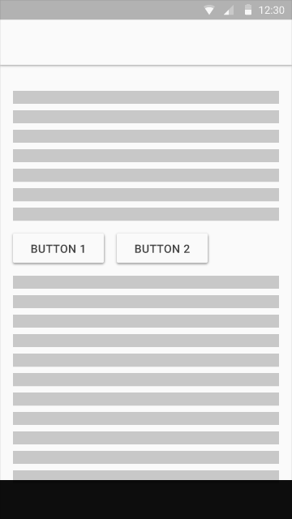    
 
### 底部固定按钮

如果需要一个对用户持续可见的功能按钮, 应该首先考虑使用悬浮响应按钮。如果需要一个非主要，但是能快速定位到的按钮, 则可以使用底部固定按钮。

    

    

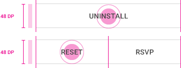   
 
不可在底部固定按钮的区域内使用浮动按钮.

 
底部固定按钮也可以用在内容可拉动的对话框中，前提是要加上divider。

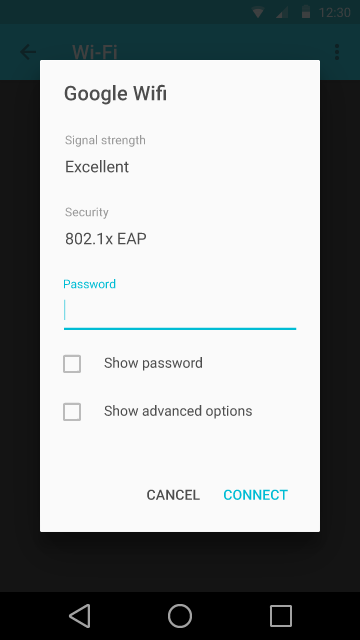    

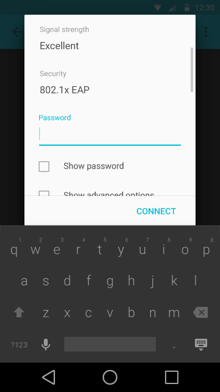  

## 主按钮    

### 悬浮响应按钮

悬浮响应按钮是促进动作里的特殊类型。 是一个圆形的漂浮在界面之上的拥有一系列特殊动作的按钮，这些动作通常和变换、启动、以及它本身的转换锚点相关。  

更多关于悬浮响应按钮的信息, 请参考 [模式：促进的动作(Promoted Actions)](../patterns/promoted-actions.html)。

    

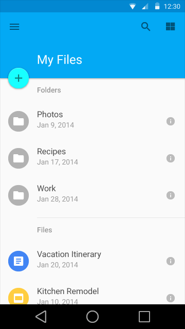    
 
悬浮响应按钮有两种尺寸: 默认尺寸和迷你尺寸. 迷你尺寸仅仅用于配合屏幕上的其他元素制造视觉上的连续性。

   

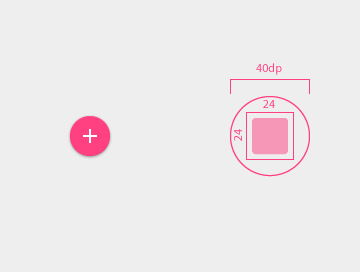   
 
### 浮动按钮

浮动按钮使按钮在比较拥挤的界面上更清晰可见。能给大多数扁平的布局带来层次感。
 
    

    
 
    
要    
浮动按钮的正确使用。   

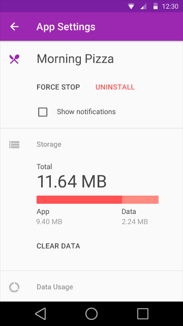    
不要   
按钮不明显。    

### 扁平按钮

扁平按钮一般用于对话框或者工具栏, 可避免页面上过多无意义的层叠。

   
 
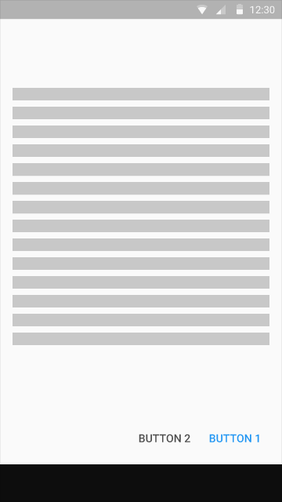   

   
要   
扁平按钮的正确使用。   

    
不要  
层次感太重。   

### 扁平和浮动按钮状态

按钮状态模拟

浮动按钮看起来像一张放在页面上的纸片—点击后会浮起来并表现出色彩.

扁平按钮会一直保持和页面贴合的状态，点击后会填充颜色。

墨水效果会跟着焦点的改变从一个按钮转换到另一个按钮。 聚焦状态的动画会表现出正常状态和点击状态间来回切换的过渡效果。

模拟按钮状态的时候, 可以使用图形轮换来表现动画。注意聚焦状态会一直处于动画的状态。 (下面这些图并没有显示出真实的聚焦状态。)

      
Flat Light/Light color    
最小宽度: 88 dp, 高度: 36 dp       
覆盖状态: 20% #999, 点击状态: 40% #999, 不可用状态: 10% #999     
 
    
Flat Dark/Dark Color   
最小宽度: 88 dp, 高度: 36 dp     
覆盖状态: 15% #ccc, 点击状态: 25% #ccc, 不可用状态: 10% #ccc     
 
      
Raised Light/Light Color  
最小宽度: 88 dp, 高度: 36 dp     

     
Raised Dark/Dark Color  
最小宽度: 88 dp, 高度: 36 do  
正常状态: Color 500, 覆盖状态: Color 600, 点击状态: Color 700,
不可用状态: 10% #ccc  

### 按钮动态效果

<video src="http://materialdesign.qiniudn.com/videos/components-buttons-mainbuttons-buttons-motion1_large_xhdpi.webm" controls="controls" width="360" loop height="450"></video>    
扁平按钮    

<video src="http://materialdesign.qiniudn.com/videos/components-buttons-mainbuttons-buttons-motionraised_large_xhdpi.webm" controls="controls" width="360" loop height="450"></video>    
浮动按钮   

## 其他类型的按钮    

### 图标开关
  
图标适合用在应用导航条或者工具条上，作为动作按钮或者开关。

图标开关可以在它的范围内呈现弹性或者非弹性的墨水扩散涟漪效果. 更多信息请参考： [面响应](../animation/responsive-interaction.html#responsive-interaction-ink-reactions).

   

   

   
 
### 移动端下拉菜单按钮

**下拉菜单按钮**  
  
下拉菜单按钮可以用来控制对象状态; 一般会有两个甚至更多的状态。 按钮会显示当前状态以及一个向下的箭头—当按钮触发后, 一个包含所有状态的菜单会在按钮周围弹出（通常都是在下方）. 菜单中的状态通常会以字符、调色板、图标或者其他的形式呈现出来。点击任意一个状态将会改变按钮的状态显示。这展示的是一个常见的带有列表式菜单的下拉菜单按钮。

    

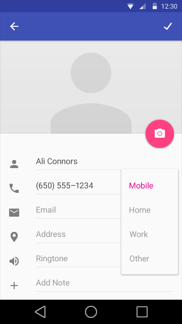  
 
**溢出下拉菜单按钮**  
  
这种类型的下拉菜单按钮不会显示当前状态，而是显示一个向下箭头或者一个默认菜单图标。点击后会弹出菜单。点击菜单中的任意一个选项将会引导到对应的设置页面。

**分段式下拉菜单按钮**  
  
分段式下拉菜单按钮有两个区域: 当前状态和下拉箭头。点击当前状态会触发状态相应的动作。点击下拉箭头则会弹出所有状态菜单; 点击任意一个状态会改变当前的状态。

**可编辑分段式下拉菜单按钮**  
  
可编辑分段式下拉菜单按钮的当前状态位置是可编辑的（例如用来选择文字大小的下拉菜单）. 点击当前状态位置会触发相应的动作并且当前状态会变成可编辑。点击下拉箭头会显示所有状态。

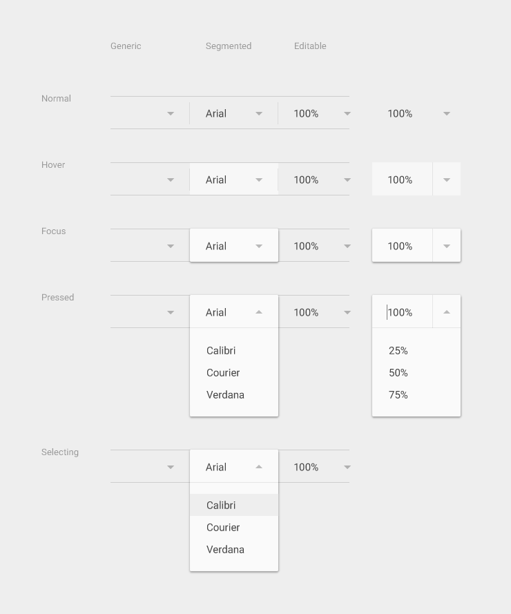
 
<video crossorigin="anonymous"  loop  controls width="359" height="401">
<source src="http://materialdesign.qiniudn.com/videos/components-menus-menus-textfield_dropdown_spec_large_xhdpi.webm" type="video/webm">
</video>     
 
### 桌面下拉相关

桌面应用工具栏   

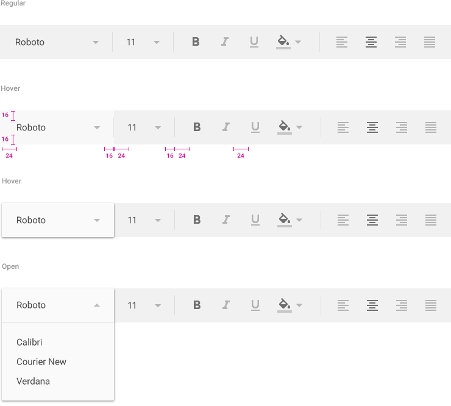   

> 原文：[Buttons](http://www.google.com/design/spec/components/buttons.html)  翻译：[7heaven](http://github.com/7heaven)  校对：[尚未校对](design.1sters.com)
