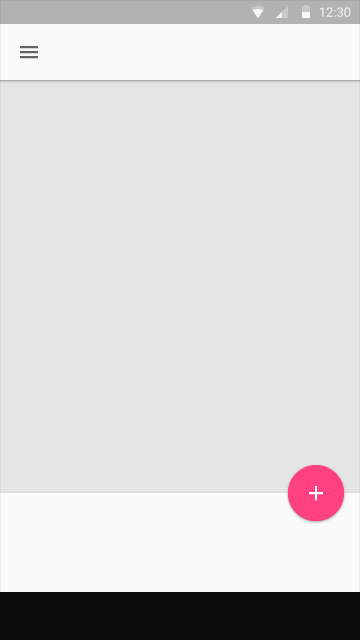
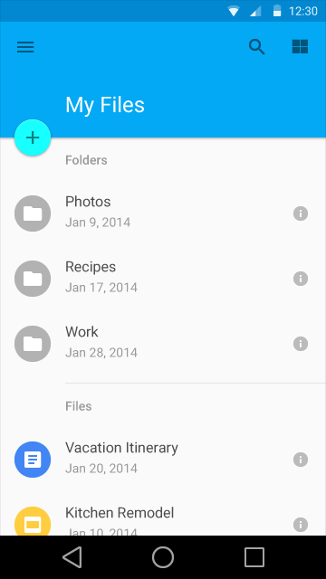
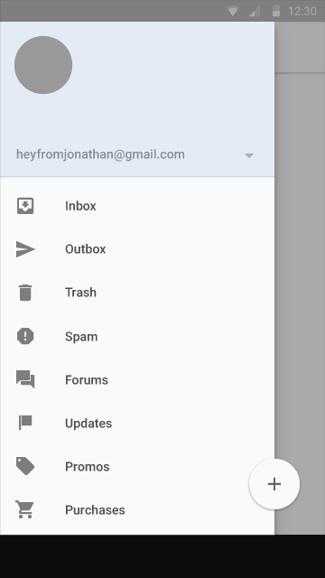
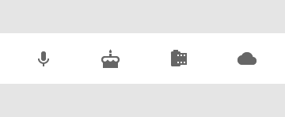
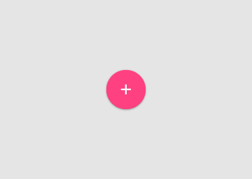
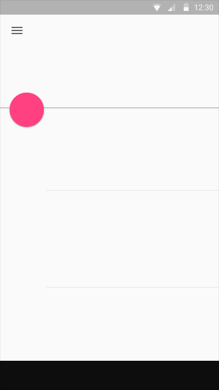
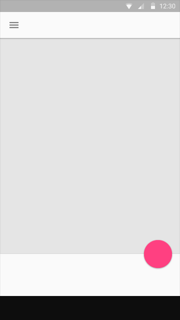
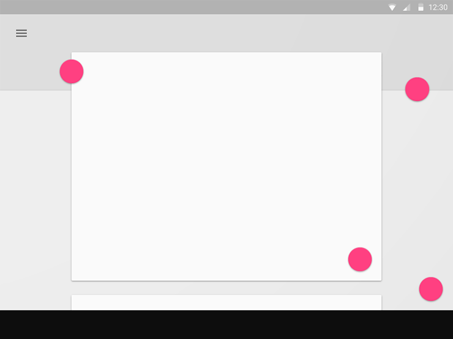
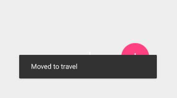

# 改进的操作

##浮动按钮

浮动按钮是一个改进操作的一个特殊例子。它有一个浮在整个界面之上的图标，并且在改变、启动、转换锚点时有特殊的动作，这使得浮动按钮与其他的按钮区别开来。  

浮动按钮的大小有两种：默认大小的和迷你版的。迷你版的浮动按钮只应在需要和屏幕上的其他元素产生视觉上的延续性时使用。    
 
        
        
        
         

###相关内容

不是每个界面都需要一个浮动按钮。浮动按钮应该包含一个应用里最主要的操作。在屏幕的左侧的界面中，它最主要的操作通过点击屏幕来打开图库里的图片，所以这里不需要浮动按钮。而在屏幕的右侧的界面里，它最主要的功能是添加文件。对于这种情况，放置一个浮动按钮是比较合适的。  

         
要   
    
          
要     
        
浮动按钮是界面里最突出的按钮，所以一个界面尽量只使用一个浮动按钮。     

         
不要   
       
          
不要  
             
不要在对话框里用浮动按钮。用扁平的按钮即可。      

         
要          

        
不要   
                
不要把浮动按钮吸附在侧边抽屉（Side drawer）的边上，这会使得用户分心，不能完成当前的操作。侧边抽屉（Side drawer）是用来作导航的。   
     
         
要  
       
         
不要   
        
不要把浮动按钮和下拉菜单关联到一起。     
  
        
要  
       
         
不要              

###相关动作

把多出来的操作放在工具栏的“溢出（overflow）”菜单里面，而非浮动按钮里面。   
  
         
要   
      
      
要   
            
         
要   
    
           
不要            

如果一个应用的特点是添加文件种类，那么浮动按钮在首次点击后可以变成几个相关的按钮。        

             
要   
          
            
不要   

但是，如果你点击浮动按钮后出现的动作选项与浮动按钮无关，并且这些按钮又不是浮动按钮的表达意义的自然延伸，那么这些动作选项最好放到“溢出”菜单里面。 
   
         
要                 
      
不要   
            
如果点击一个浮动按钮后它变成一个工具条，那么这个工具条应该包含相关的选项。在这个例子里，用户可以根据不同的选项来选择添加媒体的类型。    
   
      
要                

      
要                

不要将浮动按钮变成一个包含不相干或让人困惑的选项的工具条。   

        
不要                    

      
不要                   

浮动按钮可以包含一列联系人。   

      
要   
           
      
要              

但它不应包含不相干的选项。    

      
不要              

      
不要                  

###特性

使用浮动按钮做一些保护性的操作，像创建、加入我的最爱、分享、导航和浏览。 
  
      
要      

通常情况下，避免用浮动按钮做一些破坏性的操作，比如归档或删除到垃圾箱；不够明确的动作；警告或标记为错误；像剪切文本这样受限制的任务；或是应该在工具栏里出现的操作，比如调节音量或是改变字体颜色。浮动按钮不应包含应用栏（译者注：工具栏、状态栏之类）上的图标或是状态栏上的信息，比如通知。不要在浮动按钮上放置任何标记或是其他元素。    

      
不要   
   
为了保持一致性，要始终使用圆形的浮动按钮，这样不致于让用户感到困惑。    

      
要    
                
      
不要               

不要让浮动按钮跳起来。    

        
要             

      
不要              

###放置位置

你可以根据图框的间距规则放置浮动按钮，你也可以把浮动按钮吸附扩展的应用栏（译者注：工具栏、状态栏之类）的边上。   
   
      
要   
         
      
要              

浮动按钮可以附在页脚或是某块扩展的区域的边上。    

      
要            

      
要           

不能把随意地把浮动按钮放到一个位置。当浮动按钮附在工具栏上时候要注意，它可能会和其他控件重叠或覆盖。   

      
不要             

      
不要                    

浮动按钮可以附在一个延伸的页头上。   

      
要                   

浮动按钮可以附在工具栏边上，也可以附在一块区域的结构化的元素（只要它不盖住其他元素）上。   

      
要                  

浮动按钮可以附在某块区域的边缘上。   

      
要                     

不要在一个界面里放置多个浮动按钮。    

      
不要                   

不要把浮动按钮吸附在抽屉边上或放到抽屉里面。   
   
      
不要                  

不要把一个界面里的每个控件都关联一个浮动按钮。   

      
不要                    
  
不要让提示框（译者注：原文snackbars or toasts，是两种UI元素,具体可以查看Componnent>Snackbars and Toasts里的解释）遮住浮动按钮。   
   
      
要   
                    
      
不要                  

> 原文：[Promoted Actions](http://www.google.com/design/spec/patterns/promoted-actions.html)  翻译：[ZeroLu](https://github.com/ZeroLu)  校对：[sisyphus60](https://github.com/sisyphus60)  
